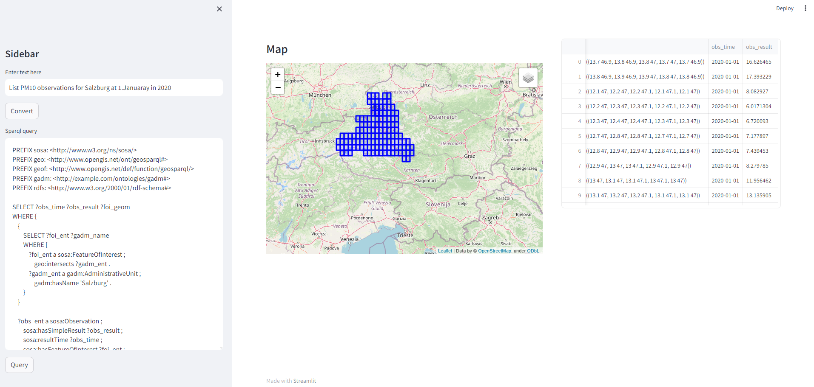

# Air Quality Knowledge Graph with CAMS Data

This project aims to create an Air Quality Knowledge Graph using data from the Copernicus Atmosphere Monitoring Service (CAMS) and to provide accessibility through natural language queries. At a high level, the project consists of three components working together to achieve this goal.

## Components Overview

1. **aq_kg_creation**: Data Acquisition and RDF Conversion
   - **Objective**: Convert CAMS Air Quality data into RDF format.
   - **Description**: This component handles the acquisition and conversion of CAMS data into RDF, making it suitable for integration into semantic web applications. It ensures the data is available for advanced querying and visualization.
   
2. **aq_kg_query**: RDF Data Storage and Querying
   - **Objective**: Prepare the Strabon RDF store for data storage and querying.
   - **Description**: This component guides you through the setup of the Strabon RDF store, data storage, and querying. Strabon serves as the database for storing and retrieving RDF data efficiently.
   
3. **aq_kg_text_interface**: Text-to-SPARQL with OPENAI API
   - **Objective**: Convert natural language text into SPARQL queries for data retrieval.
   - **Description**: This component provides the necessary code and files to leverage the OPENAI API for converting natural language text into SPARQL queries. It allows users to query the Air Quality Knowledge Graph using human-friendly language.

For detailed documentation on each component, refer to their respective folders.

### Set-Up

1) Clone repository
```bash
git clone https://github.com/terranea/AQQA.git
```

2) We recommend creating a virtual environment before installing dependencies
```bash
conda create -n AQQA python=3.11
conda activate
```

3) Install requirements
```bash
pip install -r requirements.txt
```

4) Set STRABON_SPARQL_ENDPOINT variable in *components/aq_kg_query/config.py*. Point to your hosted Strabon endpoint.
5) Adjust directories in *components/aq_kg_text_interfact/config.py* according to the explanations within *components/aq_kg_text_interfact/README.md*

6) Enter working directory 
```bash
cd AQQA
```


## Web UI

To illustrate the process, you can utilize the Streamlit app. It facilitates the conversion of natural language into SPARQL queries for querying CAMS AQ data, sending the queries to the Strabon database, and presenting the results visually on a map or in tabular data format.

7) To start the app run
```bash
cd components
streamlit run app.py
```

Then the streamlit app should be accessible on 127.0.0.1:8501 




## Running AQQA with Docker

1) Build the docker image from the Docker file
```bash
docker build -t aqqa_image .
```

2) Run the docker container in interactive mode
```bash
docker run -it -p 8501:8501 aqqa_image /bin/bash
```

3) Set STRABON_SPARQL_ENDPOINT variable in *components/aq_kg_query/config.py*. Point to your hosted Strabon endpoint.
4) Adjust directories in *components/aq_kg_text_interfact/config.py* according to the explanations within *components/aq_kg_text_interfact/README.md*

5) To start the app run
```bash
cd components
streamlit run app.py
```