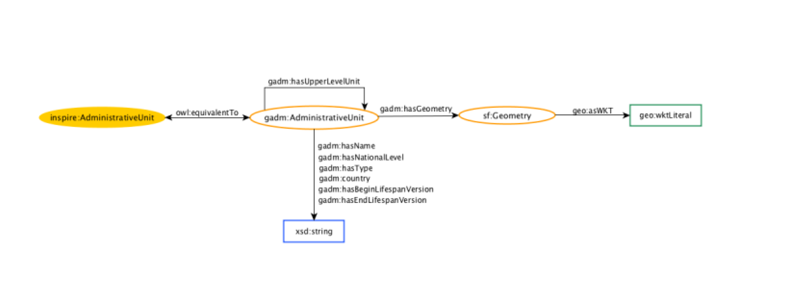

## Instructions for creating your own Air Quality Knowledge Graph with CAMS data

The following instructions guide you in creating your own Air Quality Knowledge Graph. You can either execute the individual steps by running the python files in the **data_broker_components/** folder, or utilize the provided bash scripts (for more automatization) as described in the documentation below. Instructions for running the python scripts in the command line is provided in the README.md in the **data_broker_components/** folder. 

### Step 1: Create CAMS Air Quality RDF files

The task is to convert CAMS Air Quality data, which can be downloaded from the Atmospheric Data Store (https://ads.atmosphere.copernicus.eu), to RDF so that it can be integrated into semantic web applications, analyzed alongside other linked data sources, and made accessible for advanced data querying and visualization. The data will be converted based on an RDF schema which is based on the popular and well established SOSA ontology (https://www.w3.org/2015/spatial/wiki/SOSA_Ontology) The utilized RDF schema is visualized in the image below:


1. In the **create_CAMS_AQ_RDF.sh** script define which CAMS AQ data should be donwloaded and converted to RDF. Define the following parameters:
    - **Path to Data** e.g.
    ```bash 
    BASE_PATH="/mnt/data/CAMS"
    ```
    - **Bounding Box** e.g.
    ```bash 
    bounding_box="45.82 50.65 8.95 17.22"
    ```
    - **Years and months of interest** e.g.
    ```bash 
    years=(2020)
    months=(01 02 03 11)
    ```
    - **Air Quality Variables of interest** e.g.
    ```bash
    variables_short=("co" "no2" "o3" "pm10" "pm2p5" "so2")
    variables_long="carbon_monoxide nitrogen_dioxide ozone particulate_matter_10um particulate_matter_2.5um sulphur_dioxide"
    ```
    <span class="grey-italic">In this case the variables have to be specified in short and long form. This inconvenience will be fixed in future commits.</span>


2. In the **data_broker_components/config.py**-file the specified constants need to point to the right files. 
    - **PATH_TO_CDSAPIRC**: This constant stores the path to the Climage Data Store API Key. You have to create a key for yourself, store it in a folder and set the contant to the directory of this file. For the API key creation, follow this instructions: https://cds.climate.copernicus.eu/api-how-to 
    - **Path_TO_NAMESPACES_JSON**: This constant points to the json file where relevant namespaces their short forms are saved. 

3. Run the **create_CAMS_AW_RDF.sh** file
    - Make the file executable, by running the following command in the terminal:
    ```bash
    chmod +x create_CAMS_AQ_RDF.sh
    ````
    - Execute the script in the terminal
    ```bash
    ./create_CAMS_AQ_RDF.sh
    ```

4. Check out the outputs.
    - In the BASE_PATH folder you specified shoud be three subfolders:
        - raw: contains the zipped nc-file downloaded from Athmosperic data store
        - processed: contains the clipped and aggregated nc-files. One file for each variable
        - RDF: contains the final RDF files of CAMS Air Quality data and the reference raster with the geometries


### Step 2: Create GADM RDF files

The task is to convert shapefiles from a zipped GADM (Global Administrative Areas) folder into RDF (Resource Description Framework) format. This is done so that Air Quality data can be retrieved for specific adaministrative units (e.g. Linz or Munich). The shapefile are converted to RDF based on the following RDF schema taken from Bereta, K., Caumont, H., Daniels, U., Goor, E., Koubarakis, M., Pantazi, D.A., Stamoulis, G., Ubels, S., Venus, V. and Wahyudi, F., 2019, March. The Copernicus App Lab project: Easy Access to Copernicus Data. In EDBT (pp. 501-511).:




1. **Download GADM folders for countries of interest**: You can download GADM shapefiles in ZIP format from the [GADM website](https://gadm.org/). Use the provided URL as an example to download a specific GADM dataset. You can also use the following curl command to download the dataset:

    ```bash
    curl -o gadm_dataset.zip https://geodata.ucdavis.edu/gadm/gadm4.1/shp/gadm41_AUT_shp.zip
    ```

2. **Set the input and outputpaths in the create_GADM_RDF.sh file**: 

    ```bash
    # Define common variables
    BASE_PATH="/mnt/data/GADM"

    # path to input data
    path_to_austria_gadm_zip="${BASE_PATH}/raw/gadm41_AUT_shp.zip"
    path_to_german_gadm_zip="${BASE_PATH}/raw/gadm41_DEU_shp.zip"

    # path to output
    path_to_austria_rdf="${BASE_PATH}/RDF/gadm_AUT_RDF.ttl"
    path_to_german_rdf="${BASE_PATH}/RDF/gadm_DEU_RDF.ttl"
    ```

3. **Run the create_GADM_RDF.sh file**

    - Make the file executable, by running the following command in the terminal:
    ```bash
    chmod +x create_GADM_RDF.sh
    ````
    - Execute the script in the terminal
    ```bash
    ./create_GADM_RDF.sh
    ```

3. **Output**: The script will convert the shapefiles into RDF format and save the resulting RDF graph in the specified output path 


### Step 3 (Optional): Create RDF files from Sensor Community Air Quality Measurements

This step can be done when you want to enrich the Knowledge Graph with in-situ Air Quality measurements from the Sensor Community. (https://sensor.community/de/). The in-situ data is converted to RDF using the same ontology as used for the CAMS AQ data. 

To access the Sensor Community data and convert it RDF the following steps has to be taken:

1. **Create csv-file storing IDs of sensors we want to access**

We first want to create a list storing the IDs of all the sensors whose data we want to access. To create such a list you can use the jupyter notebook in **notebooks/implementation_notebooks/get_community_sensor_IDs.ipynb**. To adapt the code so you can access information about sensors relevant to your need, please have a look at this (unofficial) documentation: https://api-sensor-community.bessarabov.com/

The csv should look like the following table:

| sensor_id |   lon   |   lat   |
|-----------|---------|---------|
|    4      | 11.538  | 48.138  |
|    5      |  9.2    | 48.776  |
|    6      | 11.644  | 48.242  |
|    8      | 11.0028 | 49.6000 |
|   10      | 10.224  | 50.074  |
|   13      | 11.44   | 48.77   |
|   14      |  8.952  | 50.112  |
|   23      |  9.0    | 48.67   |


2. **Convert the data of the selected sensors to RDF**

To access and convert the sensor data to RDF you can execute the **create_Sensor_Community_RDF.sh** script. Before you do that, adjust the following variables to your needs. 

```bash
# Path where all the data should be stored
BASE_PATH="/mnt/data/Sensor_Community"
years=(2020)
months=(1 2)
# Point to the location of the sensor id csv file
PATH_TO_SENSOR_IDS="${BASE_PATH}/sensor_community_ids_aoi_sds011.csv"
# Define the directory where the RDF files should be stored
OBSERVATIONS_PATH="${BASE_PATH}/observations"
```

After executing the **create_Sensor_Community_RDF.sh** the sensor data should be converted to RDF files, sharing the same vocabulary as the CAMS Air quality data. 

**Important** 
Please be aware that accessing the data from a lot of sensors is currently taking a large amount of time. Processing the data of ~10 sensors for one month should take about 1-2 minutes. 

**Important**
In the scripts it is assumed that you access sensors of type "sds011" which only measure PM25 and PM10 values. Small adjustments must be made to access data from other sensor types. 


### Step 4 (Optional): Create single RDF file for storing all relevant AQ data

Finally you can merge all the relevant RDF files into one file. For that purpose you can use the **data_broker_components/create_ttl_data_dump.py** script. 
Adjust the directories at the beginning of the file and then execute.

```python
python create_ttl_data_dump.py
```

**NOTE** The file **AQ_observable_properties.ttl** is stored in the ontology folder


