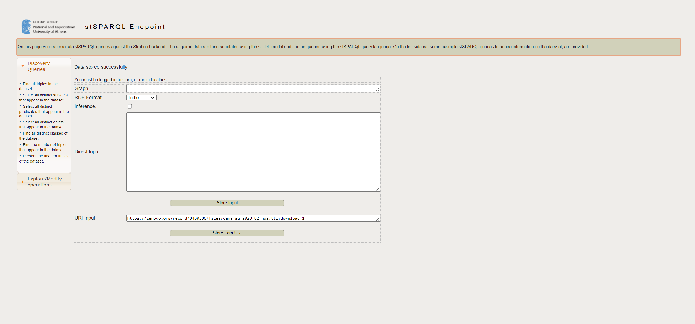

# Instructions for RDF Data Storage and Quering 

This module describes how to upload RDF data to Strabon and interact with the SPARQL endpoint by running queries to retrieve specific data from our AQ Knowledge Graph.

## Step 1: Set-Up Strabon Instance

Add steps to build docker file with right java configurations

1. **Set-Up VM on WeKeO**

For our purposes we created the following Virtual Machine (VM)
- Flavor: **eo2.2xlarge**
- VCUP: 8
- RAM: 32GB
- Storage: 128GB

We assigned a floating IP to the VM following this instructions:
- https://wekeo.docs.cloudferro.com/en/latest/networking/How-to-Add-or-Remove-Floating-IP%E2%80%99s-to-your-VM-on-WEkEO-Elasticity.html?highlight=floating%20IP

We set a rule for opening the Port 9999 following this instructions:
- https://wekeo.docs.cloudferro.com/en/latest/networking/How-can-I-open-new-ports-port-80-for-http-for-my-service-or-instance-on-WEkEO-Elasticity.html?highlight=Open%20port


2. **Important installations on VM**

Installation of gpg
```bash
sudo apt-get install gnupg
```

Install of docker following this instructions:
- https://www.digitalocean.com/community/tutorials/how-to-install-and-use-docker-on-ubuntu-20-04


3. **Clone Strabon repository from Github**

```bash
git clone https://github.com/AI-team-UoA/Strabon/tree/main
```

4. **Adjustments of Docker File. Set Java 8 as default**

```bash
# SET UP JAVA 8
ENV JAVA_HOME /usr/lib/jvm/java-8-openjdk-amd64/
ENV PATH $JAVA_HOME/bin:$PATH
RUN export JAVA_HOME
```

5. **Build docker image**
```bash
docker build -t strabon .
```

6. **Run strabon container**
```bash 
docker run -d eouser--name strabon-container -p 9999:8080 -v /mnt/volume:/inout strabon
```

7. **Run configuration in container and start webserver**
```bash
sudo docker exec -it strabon-container /bin/bash
```
```bash
./usr/local/bin/conf.sh
```

## Step 2: Store data in Strabon

The next step is to store the prepared RDF files in Strabon. Here we have 2 options. Either storing the data via the web interface or programmatically via HTTP requests. The following two chapters describe one of these options.

### 2.1.: Store data via Web-UI

- Enter the following URL into your browser:
<IP>:9999/Strabon
- In the `**Explore/Modify operations** section choose **Store**
- Choose RDF Format: Turtle
- Enter the Url of your datasetin URI input (requires data upload before; e.g access data at https://zenodo.org/record/8430386)
- Click **Store from URI**



### 2.2.: Store data via http request

- Code to demonstrate Data Upload via HTTP request has not been successfully implemented yet. 
- In Future working code will be stored in **strabon_store_data.py** file

## Step 3: Query data

The file **strabon_query_data.py** demonstrates how you can run sparql queries against the strabon endpoint. 

Make sure that first you change the **STRABON_SPARQL_ENDPOINT** variable in the config.py file

In the folder **sparql_queries** are several examples how to query the AQQA KG. In the following chapter we will go through some of them. 


## Step 4: Explanation of selected SPARQL queries

Dont forget to put the prefixes before the query before running it

PREFIX sosa: <http://www.w3.org/ns/sosa/>
PREFIX geo: <http://www.opengis.net/ont/geosparql#>
PREFIX geof: <http://www.opengis.net/def/function/geosparql/>
PREFIX gadm: <http://example.com/ontologies/gadm#>
PREFIX rdfs: <http://www.w3.org/2000/01/rdf-schema#>

- **Example 1:** List first 10 observations with geometries
<pre>
SELECT ?s ?geom
WHERE {
    ?s a sosa:Observation ;
        sosa:hasFeatureOfInterest ?foi .
    ?foi geo:hasGeometry ?geom_ent .
    ?geom_ent geo:asWKT ?geom .
} 
LIMIT 10
</pre>


**Example 2:** List the first 100 values and timestamps of PM25 concentration at specific location (Linz in this example)
<pre>
SELECT ?obs_result ?obs_time
WHERE {
?obs a sosa:Observation ;
    sosa:hasFeatureOfInterest/geo:hasGeometry/geo:asWKT ?foi_geom ;
    sosa:resultTime ?obs_time ;
    sosa:hasSimpleResult ?obs_result ;
    sosa:observedProperty/rdfs:label 'PM2.5' .

FILTER (geof:sfWithin('''<http://www.opengis.net/def/crs/OGC/1.3/CRS84> POINT (14.36343 48.37428)'''^^geo:wktLiteral, ?foi_geom))
}
LIMIT 100
</pre>


- **Example 3:** Query the name of a municipality (admin lvl 4) at a given location. 
<pre>
SELECT ?gadm_name
WHERE {
    ?gadm_ent a gadm:AdministrativeUnit ;
                gadm:hasName ?gadm_name ;
                gadm:hasNationalLevel 4 ;
                geo:hasGeometry ?gadm_geom_ent .
    ?gadm_geom_ent geo:asWKT ?gadm_geom .

    FILTER (geof:sfWithin('''<http://www.opengis.net/def/crs/OGC/1.3/CRS84> POINT (11.03388 48.11644)'''^^geo:wktLiteral, ?gadm_geom))
} 
</pre>


- **Example 4:** Combining the queries from above we now want to query the first 100 PM25 measurements of Geltendorf
<pre>
SELECT ?obs_time ?obs_result
WHERE {
  ?gadm_ent a gadm:AdministrativeUnit ;
    gadm:hasName 'Geltendorf' ;
    gadm:hasNationalLevel 4 ;
    geo:hasGeometry/geo:asWKT ?gadm_geom .

  ?obs a sosa:Observation ;
    sosa:hasFeatureOfInterest/geo:hasGeometry/geo:asWKT ?foi_geom ;
    sosa:resultTime ?obs_time ;
    sosa:hasSimpleResult ?obs_result ;
    sosa:observedProperty/rdfs:label 'PM2.5' .

  FILTER(geof:sfIntersects(?gadm_geom, ?foi_geom))
}
LIMIT 100
</pre>


- **Example 5:** Provide a list of CO concentration measurements in Linz during January 2020.
<pre>
SELECT ?obs_time ?obs_result
WHERE {
    {
        SELECT ?foi_ent ?gadm_name
        WHERE {
            ?foi_ent a sosa:FeatureOfInterest ;
                geo:intersects ?gadm_ent .
            ?gadm_ent a gadm:AdministrativeUnit ;
                gadm:hasName 'Geltendorf' ;
                gadm:hasNationalLevel 3 .
        } 
    }

    ?obs_ent a sosa:Observation ;
        sosa:hasSimpleResult ?obs_result ; 
        sosa:resultTime ?obs_time ;
        sosa:hasFeatureOfInterest ?foi_ent ;
        sosa:observedProperty ?obs_prop_ent .
    ?obs_prop_ent a sosa:ObservableProperty ;
        rdfs:label 'CO' .

    FILTER (YEAR(?obs_time) = 2020 && MONTH(?obs_time) = 1)
}
</pre>


- **Example 6**: Give me the daily average of the CO values measured for Linz in January 2020
<pre>
SELECT ?obs_time (AVG(?obs_result) AS ?daily_avg)
WHERE {
    {
        SELECT ?foi_ent ?cell_geom ?gadm_name
        WHERE {
            ?foi_ent a sosa:FeatureOfInterest ;
                geo:intersects ?gadm_ent ;
                geo:hasGeometry ?cell_geom_ent .
            ?cell_geom_ent geo:asWKT ?cell_geom .
            ?gadm_ent a gadm:AdministrativeUnit ;
                gadm:hasName 'Linz' ;
                gadm:hasNationalLevel 3 ;
        } 
    }

    ?obs_ent a sosa:Observation ;
        sosa:hasSimpleResult ?obs_result ; 
        sosa:resultTime ?obs_time ;
        sosa:hasFeatureOfInterest ?foi_ent ;
        sosa:observedProperty ?obs_prop_ent .
    ?obs_prop_ent a sosa:ObservableProperty ;
        rdfs:label 'CO' .

    FILTER (YEAR(?obs_time) = 2020 && MONTH(?obs_time) = 1)
}
GROUP BY ?obs_time
ORDER BY ?obs_time
</pre>


- **Example 7:**: Give me the names of the municipalities in which the CO values exceeded 400 during January 2020?

**DOES NOT WORK YET**

<pre>
SELECT ?obs_result ?obs_time ?gadm_name 
WHERE {
    {
        SELECT ?foi_ent ?cell_geom ?gadm_name
        WHERE {
            ?foi_ent a sosa:FeatureOfInterest ;
                geo:intersects ?gadm_ent ;
                geo:hasGeometry ?cell_geom_ent .
            ?cell_geom_ent geo:asWKT ?cell_geom .
            ?gadm_ent a gadm:AdministrativeUnit ;
                gadm:hasName ?gadm_name ;
                gadm:hasNationalLevel 3 ;
        } 
    }

    ?obs_ent a sosa:Observation ;
            sosa:hasSimpleResult ?obs_result ; 
            sosa:resultTime ?obs_time ;
            sosa:hasFeatureOfInterest ?foi_ent ;
            sosa:observedProperty ?obs_prop_ent .
    ?obs_prop_ent a sosa:ObservableProperty ;
        rdfs:label 'CO' .

    FILTER (YEAR(?obs_time) = 2020 && MONTH(?obs_time) = 1)
    FILTER (?obs_result > 400)
} 
</pre>


- **Example 8:**: How many days in January 2020 were CO values measured in Linz that exceeded 500?
<pre>
SELECT (COUNT(DISTINCT ?obs_time) as ?distinct_days)
WHERE {
    {
        SELECT ?foi_ent ?cell_geom ?gadm_name
        WHERE {
            ?foi_ent a sosa:FeatureOfInterest ;
                geo:intersects ?gadm_ent ;
                geo:hasGeometry ?cell_geom_ent .
            ?cell_geom_ent geo:asWKT ?cell_geom .
            ?gadm_ent a gadm:AdministrativeUnit ;
                gadm:hasName 'Linz' ;
                gadm:hasNationalLevel 3 ;
        } 
    }

    ?obs_ent a sosa:Observation ;
        sosa:hasSimpleResult ?obs_result ; 
        sosa:resultTime ?obs_time ;
        sosa:hasFeatureOfInterest ?foi_ent ;
        sosa:observedProperty ?obs_prop_ent .
    ?obs_prop_ent a sosa:ObservableProperty ;
        rdfs:label 'CO' .

    FILTER (YEAR(?obs_time) = 2020 && MONTH(?obs_time) = 1)
    FILTER (?obs_result > 500)
</pre>


TODOs:
- Example 7 is not working
- The problem regarding the not working queries seems to be that asking data for a specific gadm unit is fine, but when exchanging the name of the unit with ?gadm_name the query breaks


